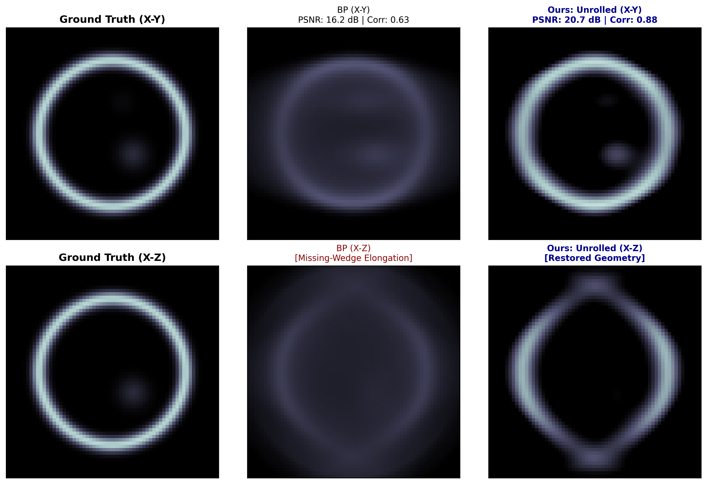
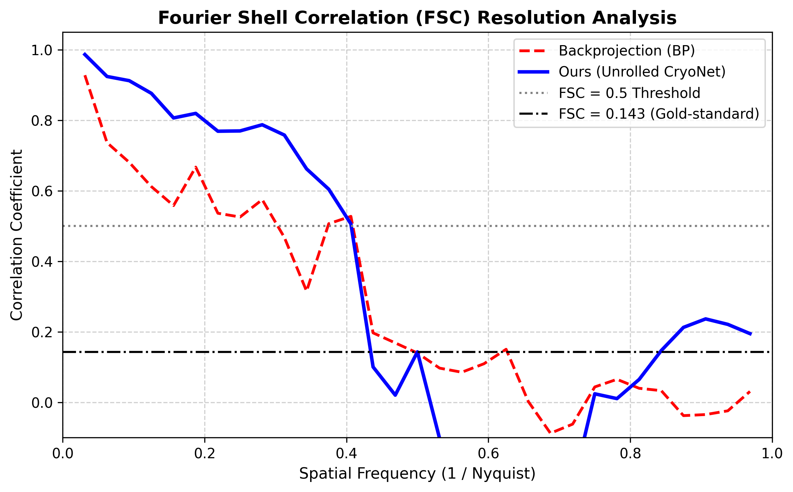

# CryoUnroll: Physics-Informed Deep Algorithm Unrolling for High-Fidelity Cryo-ET Reconstruction

[](https://www.python.org/)
[](https://pytorch.org/)
[](LICENSE)
[](https://en.wikipedia.org/wiki/Cryo-electron_tomography)

**CryoUnroll** is an open-source, physics-informed deep algorithm unrolling framework designed for high-resolution 3D **Cryo-Electron Tomography (cryo-ET)** reconstruction under severe missing-wedge conditions (±60° angular tilt range) and ultra-low signal-to-noise ratios (SNR).

Rather than relying on computationally heavy classical iterative variational solvers (e.g., Total Variation or Curvelet-regularized PDHG) or unconstrained black-box CNNs, **CryoUnroll** unrolls physical gradient descent into a truncated, trainable multi-stage architecture. By embedding differentiable parallel-beam forward projection ($A$) and adjoint backprojection ($A^T$) operators directly into each stage, the model enforces strict physical measurement consistency while learning directional 3D priors to interpolate missing-wedge spectral blind zones.

---

## Key Highlights

- **Physics-Constrained:** Strict data consistency maintained via differentiable Radon line-projection and adjoint operators ($A, A^T$).
- **Missing-Wedge Restoration:** Directional 3D convolutional priors suppress elongation artifacts along the optical beam axis ($Z$).
- **Fast Convergence:** Achieves convergence in only 3 to 5 unrolled stages, avoiding the hundreds of iterative loops required by classical solvers.
- **Biophysically Validated:** Quantitatively evaluated on crowded cellular phantoms via PSNR, Pearson Correlation (PCC), and 3D Fourier Shell Correlation (FSC).

---

## Benchmark Results

Evaluated on a biophysical cellular digital twin (crowded lipid vesicle membrane enclosing dense macromolecular complexes) with a $60^\circ$ missing-wedge blind zone ($\pm 60^\circ$ tilt range, $4.0^\circ$ angular increments) under calibrated shot noise:

| Reconstruction Method | Volumetric MSE | PSNR (dB) | Pearson Correlation (PCC) | FSC = 0.5 Cutoff (1/Nyquist) |
| :--- | :---: | :---: | :---: | :---: |
| **Backprojection (BP)** | 0.02350 | 16.24 dB | 0.6323 | 0.31 |
| **CryoUnroll (Ours)** | **0.00846** | **20.67 dB** | **0.8788** | **0.41 (+32.3%)** |

### 1. Visual Comparison: Orthogonal Cross-Sections


- **In-Plane ($X\text{–}Y$):** CryoUnroll eliminates background haze and sharply resolves the continuous lipid bilayer and internal macromolecular cores.
- **Optical Axis ($X\text{–}Z$):** Standard Backprojection exhibits pronounced diamond distortion and elongation across the missing wedge, whereas CryoUnroll restores bounded, continuous spherical geometry.

### 2. Spectral Resolution: 3D Fourier Shell Correlation (FSC)


CryoUnroll extends the usable spectral bandwidth at the conservative $\text{FSC} = 0.5$ resolution cutoff from **0.31 to 0.41 Nyquist** (+32.3% improvement), preserving critical high-frequency macromolecular features across low- and mid-frequency spectra.

---

## Algorithmic Architecture

At each unrolled stage $k \in \{0, \dots, K-1\}$, the tomographic volume state undergoes two sequential operations:

1. **Physical Data Consistency Descent:**
   $$\tilde{x}^k = x^k - \alpha_k \cdot A^T(A x^k - y)$$
   *(Anchors intermediate reconstructions to the experimental tilt-series measurements $y$ using learnable step sizes $\alpha_k$)*

2. **Learned 3D Directional Regularization:**
   $$x^{k+1} = \operatorname{ReLU}\left(\tilde{x}^k + \beta \cdot \mathcal{R}_{\theta_k}(\tilde{x}^k)\right)$$
   *(Lightweight 3D CNN parameterized to interpolate missing orientations and suppress low-dose noise)*

The terminal layer of $\mathcal{R}_{\theta_k}$ is initialized with zero weights ($\mathbf{W} = \mathbf{0}, \mathbf{b} = \mathbf{0}$), ensuring that the architecture starts as an exact physical gradient-descent reconstructor and learns structural priors stably without dying activations.

---

## Installation

### Prerequisites
- Python 3.8+
- PyTorch 2.0+ (CUDA recommended for GPU acceleration)

### Clone & Install Dependencies
```bash
git clone [https://github.com/your-username/CryoUnroll.git](https://github.com/your-username/CryoUnroll.git)
cd CryoUnroll
pip install -r requirements.txt

requirements.txt
torch>=2.0.0
numpy>=1.22.0
scipy>=1.8.0
matplotlib>=3.5.0
python-docx>=0.8.11
